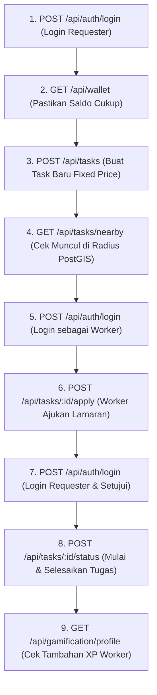

# Panduan Pengujian API dengan Postman

Dokumen ini berisi panduan komprehensif untuk melakukan pengujian (*API testing*) pada seluruh *endpoint* aplikasi **CEPAT (Cari Entry Pekerjaan Area Terdekat)** menggunakan **Postman**, platform kolaborasi dan pengujian API standar industri.

Koleksi resmi CEPAT telah dikonfigurasi dalam berkas JSON standar Postman v2.1:  
📁 `docs/postman/CEPAT.postman_collection.json`

---

## 1. Persiapan Awal (Setup)

### A. Unduh dan Pasang Postman
Jika belum terpasang, unduh aplikasi Postman dari situs resminya:
- [Unduh Postman Desktop Agent / App](https://www.postman.com/downloads/)

### B. Pastikan Server Lokal Berjalan
Sebelum memulai pengujian API, pastikan server lokal Next.js Anda sedang aktif:
```bash
npm run dev
```
*(Secara bawaan berjalan pada `http://localhost:3000`)*

### C. Import Koleksi CEPAT ke Postman
1. Buka aplikasi **Postman**.
2. Di pojok kiri atas workspace Anda, klik tombol **Import**.
3. Pilih tab **Files** lalu klik **Choose Files** (atau seret langsung berkas):
   - Arahkan ke: `docs/postman/CEPAT.postman_collection.json`
4. Klik **Import**. Koleksi **"CEPAT API - Official Collection"** akan muncul di bilah sisi kiri (*Collections sidebar*).

---

## 2. Struktur Variabel Koleksi (*Collection Variables*)

Koleksi ini menggunakan *Collection Variables* dinamis sehingga Anda tidak perlu menyalin dan menempel (*copy-paste*) token atau ID secara manual berulang kali:

| Nama Variabel | Nilai Bawaan (*Initial Value*) | Penjelasan |
|---|---|---|
| `base_url` | `http://localhost:3000/api` | Base URL endpoint API CEPAT lokal. |
| `auth_token` | *(Otomatis terisi saat login)* | Token JWT Bearer hasil autentikasi pengguna. |
| `task_id` | *(Opsional diisi UUID task)* | Digunakan untuk request detail, penawaran (bid), dan pelamar. |
| `dispute_id` | *(Opsional diisi UUID sengketa)* | Digunakan untuk mengirim bukti atau pesan mediasi sengketa. |
| `chat_room_id` | *(Opsional diisi UUID room)* | Digunakan untuk mengirim pesan obrolan. |
| `admin_token` | *(Otomatis terisi cookie / var)* | Token sesi khusus portal pengurus admin. |

> [!TIP]
> Jika Anda menguji di lingkungan deployment (misal: staging atau Vercel), Anda cukup mengubah variabel `base_url` di level Collection menjadi `https://cepat-steel.vercel.app/api`. Seluruh 30+ request akan otomatis menyesuaikan!

---

## 3. Otomatisasi Token Autentikasi (*Auto Token Capture*)

Koleksi ini telah dilengkapi skrip otomatisasi pengujian pada tab **Tests** di request **"Login (Otomatis Simpan Token)"**:

```javascript
const response = pm.response.json();
if (response.success && response.data?.session?.access_token) {
    pm.collectionVariables.set('auth_token', response.data.session.access_token);
    console.log('Token berhasil disimpan ke variable auth_token:', response.data.session.access_token);
} else if (response.session?.access_token) {
    pm.collectionVariables.set('auth_token', response.session.access_token);
}
```

Semua endpoint yang membutuhkan autentikasi (seperti pembuatan tugas, dompet, transaksi, chat, dan sengketa) telah terkonfigurasi dengan header:
```http
Authorization: Bearer {{auth_token}}
```
Dengan demikian, **cukup jalankan satu kali request Login**, dan seluruh request berikutnya langsung terotentikasi secara otomatis.

---

## 4. Rincian Modul Pengujian (7 Folder Koleksi)

Koleksi tersusun rapi dalam 7 modul utama:

### 1. Authentication
- `POST Register User Baru`: Mendaftarkan pengguna baru dengan sanitasi email disposable dan validasi Zod schema.
  - Endpoint: `{{base_url}}/auth/register`
- `POST Login (Otomatis Simpan Token)`: Autentikasi akun demo (`andi@cepat.com` / `Password123!`). Skrip tests langsung mengisi `{{auth_token}}`.
  - Endpoint: `{{base_url}}/auth/login`
- `GET Get Profil Saya (Me)`: Membaca profil aktif dari cookie SSR / bearer token.
  - Endpoint: `{{base_url}}/auth/me`
- `POST Logout`: Menghancurkan sesi Supabase SSR dan membersihkan cookie.
  - Endpoint: `{{base_url}}/auth/logout`

### 2. Tasks & Geolocation (PostGIS)
- `GET Get All Tasks (Feed Publik)`: Menampilkan daftar tugas terbuka dengan pagination dan filter kategori/status.
  - Endpoint: `{{base_url}}/tasks/feed`
- `GET Get Nearby Tasks (PostGIS Radius 2km)`: Menghitung jarak spasial riil menggunakan rumus PostGIS `ST_DWithin` / Haversine spherical.
  - Endpoint: `{{base_url}}/tasks/nearby?lat=-6.2088&lng=106.8456&radius=2000`
- `POST Buat Task Baru (Fixed Price + Escrow)`: Membuat tugas bayaran tetap dengan validasi saldo dompet terkunci (*escrow lock*).
  - Endpoint: `{{base_url}}/tasks`
- `POST Buat Task Bidding (Sealed-Bid Lelang)`: Membuat tugas tender tertutup (*blind bidding*).
  - Endpoint: `{{base_url}}/tasks`
- `GET Get Detail Task`: Melihat rincian tugas berdasarkan UUID `{{task_id}}`.
  - Endpoint: `{{base_url}}/tasks/{{task_id}}`
- `POST Ajukan Lamaran / Bid`: Mengajukan penawaran harga dan estimasi durasi pada tugas bidding.
  - Endpoint: `{{base_url}}/tasks/{{task_id}}/apply`
- `GET Get Daftar Bids (Requester Only)`: Melihat seluruh penawaran terdaftar (hanya dapat dibuka oleh pemilik tugas).
  - Endpoint: `{{base_url}}/tasks/{{task_id}}/applications`
- `POST Update Status Task (Mulai / Selesai / Batal)`: Mengubah status penugasan (*IN_PROGRESS*, *COMPLETED*, atau *CANCELLED*).
  - Endpoint: `{{base_url}}/tasks/{{task_id}}/status`
- `GET Get Scheduled Tasks (Kalender)`: Mengambil daftar tugas berdasarkan jadwal tenggat untuk sinkronisasi kalender.
  - Endpoint: `{{base_url}}/tasks/scheduled`

### 3. Wallet & Midtrans Payment
- `GET Get Wallet Saldo & Transaksi`: Melihat saldo aktif, saldo terkunci (*escrow locked*), dan riwayat mutasi.
  - Endpoint: `{{base_url}}/wallet`
- `POST Create Top-up Midtrans Snap Token`: Menginisiasi transaksi deposit dompet dan menerima token Midtrans Snap.
  - Endpoint: `{{base_url}}/wallet/topup`
- `GET Cek Status Pembayaran`: Memeriksa status transaksi Midtrans berdasarkan `order_id`.
  - Endpoint: `{{base_url}}/wallet/payment-status?order_id=TOPUP-xxxx`

### 4. Dispute & Resolution Center
- `GET Get User Disputes`: Menampilkan seluruh berkas sengketa penugasan milik pengguna aktif.
  - Endpoint: `{{base_url}}/disputes`
- `POST Buka Tiket Sengketa Baru`: Mengajukan sengketa penugasan macet/tidak sesuai (*OPEN*).
  - Endpoint: `{{base_url}}/disputes`
- `POST Kirim Bukti Sengketa (Evidence)`: Melampirkan tautan bukti foto/dokumen untuk mediasi.
  - Endpoint: `{{base_url}}/disputes/{{dispute_id}}/evidence`
- `POST Kirim Pesan Mediasi Sengketa`: Mengirim tanggapan obrolan mediasi para pihak.
  - Endpoint: `{{base_url}}/disputes/{{dispute_id}}/messages`

### 5. Gamification & Leaderboard
- `GET Get Leaderboard Peringkat`: Menampilkan klasemen peringkat pekerja terbaik berdasarkan total reputasi, XP, dan ulasan bintang 5.
  - Endpoint: `{{base_url}}/gamification/leaderboard`
- `GET Get User XP, Level & Badges`: Mengambil data lencana (*badges*), bar progress XP, dan pencapaian pengguna aktif.
  - Endpoint: `{{base_url}}/gamification/profile`

### 6. Chat & Saved Tasks
- `GET Get Daftar Kamar Chat`: Mengambil daftar saluran percakapan aktif per tugas.
  - Endpoint: `{{base_url}}/chat/rooms`
- `POST Kirim Pesan Chat`: Mengirim pesan teks terenkripsi TLS ke room tugas.
  - Endpoint: `{{base_url}}/chat/messages`
- `GET Get Tugas Tersimpan (Bookmarks)`: Mengambil daftar tugas yang ditandai untuk nanti.
  - Endpoint: `{{base_url}}/saved-tasks`
- `POST Toggle Bookmark Tugas`: Menandai atau membatalkan penandaan bookmark suatu tugas.
  - Endpoint: `{{base_url}}/saved-tasks/toggle`

### 7. Admin Console
- `POST Admin Login`: Masuk ke konsol admin menggunakan kredensial (`admin@cepat.com` / `Password123!`). Sesi aman disetel melalui cookie httpOnly `admin_token`.
  - Endpoint: `{{base_url}}/admin/auth/login`
- `GET Get Admin Overview Stats (KPI)`: Mengambil 5 metrik KPI (Total Transaksi, Pengguna Aktif, Task Selesai, Sengketa Terbuka, Rasio Penyelesaian).
  - Endpoint: `{{base_url}}/admin/stats`
- `GET Get Admin Users List`: Manajemen akun pengguna, status pembekuan akun, dan verifikasi identitas.
  - Endpoint: `{{base_url}}/admin/users?page=1&limit=10`
- `GET Get Admin Tasks List`: Pemantauan status seluruh tugas lintas kategori.
  - Endpoint: `{{base_url}}/admin/tasks?page=1&limit=10`
- `GET Get Admin Reports List`: Antrean tiket laporan pelanggaran dari masyarakat.
  - Endpoint: `{{base_url}}/admin/reports?status=pending`
- `GET Get Admin Disputes List`: Daftar sengketa aktif yang membutuhkan intervensi admin/mediator.
  - Endpoint: `{{base_url}}/admin/disputes`
- `GET Global Search Admin (Ctrl+K)`: Pencarian instan lintas pengguna, pekerjaan, dan kategori.
  - Endpoint: `{{base_url}}/admin/search?q=foto`

---

## 5. Alur Uji Rekomendasi (*End-to-End Testing Flow*)

Untuk menguji alur bisnis secara menyeluruh dari awal hingga selesai, ikuti urutan request berikut:



1. **Autentikasi Akun**:
   - Jalankan `POST Login` dengan email demo `andi@cepat.com` (Requester) atau `budi@cepat.com` (Worker).
2. **Eksplorasi Feed & Radius Geolocation**:
   - Jalankan `GET Get Nearby Tasks` dengan parameter lat/lng Monas (`-6.2088, 106.8456`) untuk melihat pemfilteran jarak spasial PostGIS.
3. **Penerbitan Tugas & Escrow**:
   - Buat tugas baru dengan mengeksekusi `POST Buat Task Baru`. Salin `id_task` dari hasil respons JSON ke *Collection Variable* `task_id`.
4. **Pengajuan Tawaran & Obrolan**:
   - Ganti login ke akun Worker, lalu jalankan `POST Ajukan Lamaran / Bid`.
   - Gunakan folder **Chat** untuk menguji komunikasi real-time antara pemberi tugas dan pekerja.
5. **Pemeriksaan Konsol Admin**:
   - Jalankan `POST Admin Login` dengan `admin@cepat.com`. Postman otomatis menyimpan cookie `admin_token`.
   - Jalankan `GET Get Admin Overview Stats (KPI)` untuk melihat agregasi analitik platform secara real-time.

---

## 6. Tips & Troubleshooting

> [!NOTE]
> **Manajemen Cookie di Postman**:  
> Endpoint `/api/auth/me` dan `/api/admin/*` memanfaatkan HTTP-Only Cookies (`sb-access-token` dan `admin_token`). Postman Desktop App memiliki fitur **Cookie Jar** bawaan yang secara otomatis menangkap header `Set-Cookie` dari respons server dan mengirimkannya kembali pada request berikutnya ke `localhost`.

> [!WARNING]
> **Rate Limiting (HTTP 429 Too Many Requests)**:  
> CEPAT menerapkan *sliding-window in-memory rate limiter* (misal: 5 percobaan login/menit, 3 request OTP/menit). Jika Anda menerima status `429 Too Many Requests`, tunggu 60 detik sebelum melakukan request ulang.

> [!TIP]
> **Menjalankan Automated Collection Runner**:  
> Anda dapat menjalankan seluruh rangkaian pengujian secara otomatis tanpa mengklik satu per satu:
> 1. Klik nama koleksi **CEPAT API - Official Collection**.
> 2. Klik tombol **Run Collection** di panel kanan.
> 3. Pilih urutan folder yang ingin dieksekusi, lalu klik **Run CEPAT API**.
