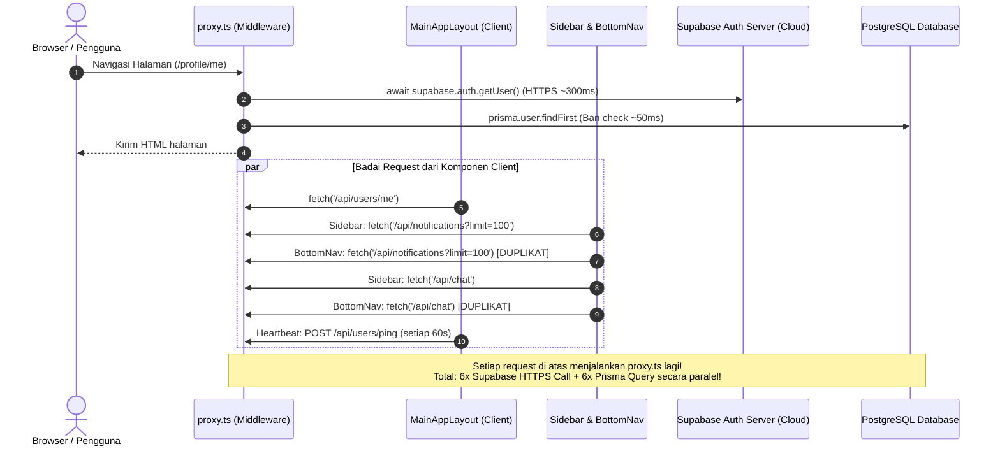

# 📋 Laporan Audit Komprehensif Kode Aplikasi CEPAT (Itechno)

> **Tanggal Audit:** 4 September 2026  
> **Auditor:** AI System Code Auditor  
> **Cakupan:** Seluruh Proyek (Next.js 16 App Router, Prisma ORM, Supabase Auth/Storage, Midtrans Gateway, Firebase Admin/FCM, PostgreSQL PostGIS)  
> **Status Dokumen:** Rekomendasi Resmi & Rencana Perbaikan

---

## 🎯 Ringkasan Eksekutif & Skor Evaluasi

| Aspek Evaluasi | Skor (1-100) | Kategori | Ringkasan Status |
| :--- | :---: | :---: | :--- |
| **Keamanan (Security)** | **68 / 100** | ⚠️ *Cukup (Perlu Perhatian Khusus)* | Validasi payload Zod, Midtrans signature verification dengan `timingSafeEqual`, dan magic bytes upload sudah baik. Namun, ditemukan kerentanan **Header Injection IDOR** pada endpoint profil, risiko pembatalan sepihak pada multi-worker task, dan rate limiting in-memory yang rentan spoofing. |
| **Optimalisasi (Optimization)** | **62 / 100** | ⚠️ *Butuh Perbaikan Kritis* | UI/UX sangat modern dan kaya fitur, namun performa terhambat parah oleh **duplikasi fetch di `Sidebar` & `BottomNav`**, overhead network call Supabase di `proxy.ts` pada setiap HTTP request, ketiadaan GiST spatial index pada koordinat, bug fungsi JS pada raw SQL PostGIS, serta bundle bloat. |
| **Kualitas Kode & Typing** | **65 / 100** | ⚠️ *Perlu Standarisasi* | TypeScript typecheck lolos (`tsc --noEmit` exit 0), tetapi ESLint mencatat **295 problem (160 error, 135 warning)** akibat penggunaan `any` massal dan cascading render pada effect React 19, sehingga `ignoreBuildErrors: true` terpaksa diaktifkan. |

---

## 🛡️ Bagian I: Audit Keamanan (Security Audit)

### 1. Temuan Kritis & Tingkat Tinggi (High & Critical)

#### 🔴 [CRITICAL] 1.1 Header Spoofing & IDOR pada `/api/users/me`
* **Lokasi File:** [`src/proxy.ts`](file:///c:/Users/rajab/Documents/Itechno/Itechno/src/proxy.ts#L183-L195) dan [`src/app/api/users/me/route.ts`](file:///c:/Users/rajab/Documents/Itechno/Itechno/src/app/api/users/me/route.ts#L8-L42)
* **Deskripsi Masalah:**
  Di dalam `proxy.ts`, header request dari browser di-copy ke downstream request:
  ```ts
  const requestHeaders = new Headers(request.headers)
  if (user) {
    requestHeaders.set('x-auth-user-id', user.id)
    if (user.email) requestHeaders.set('x-auth-user-email', user.email)
    if (dbUserId) requestHeaders.set('x-user-db-id', dbUserId)
  }
  ```
  Jika request tidak terautentikasi (`user === null`), `proxy.ts` **tidak menghapus** header `x-user-db-id` atau `x-auth-user-id` yang dikirim langsung oleh penyerang melalui HTTP headers (curl/fetch).  
  Kemudian di `GET /api/users/me`:
  ```ts
  const headerDbUserId = request.headers.get("x-user-db-id");
  const headerAuthId = request.headers.get("x-auth-user-id");
  if (headerAuthId && (headerAuthEmail || headerDbUserId)) {
    authUser = { id: headerAuthId, email: headerAuthEmail || undefined };
  }
  const whereClause = headerDbUserId ? { id_user: headerDbUserId } : ...;
  const dbUser = await prisma.user.findFirst({ where: whereClause, ... });
  ```
  Karena endpoint `/api/users/me` tidak ada dalam daftar `protectedPrefixes` di `proxy.ts`, seorang penyerang unauthenticated dapat mengirim header:
  `x-auth-user-id: arbitrary-id` dan `x-user-db-id: <id_user_target>`  
  Sistem akan langsung mengembalikan **seluruh data privat korban** (email, nomor telepon, alamat, saldo dompet, dll.) tanpa validasi token auth sama sekali!
* **Dampak:** *Full Authentication Bypass & Information Disclosure (IDOR)*.
* **Solusi Perbaikan:**
  1. Di awal `proxy.ts`, hapus paksa header internal dari request client:
     ```ts
     request.headers.delete('x-auth-user-id');
     request.headers.delete('x-auth-user-email');
     request.headers.delete('x-user-db-id');
     ```
  2. Masukkan rute `/api/users/me` ke dalam rute yang wajib dicek auth, atau jangan pernah mempercayai header dari client di `/api/users/me` tanpa verifikasi session Supabase valid.

---

#### 🔴 [HIGH] 1.2 Celah Pembatalan Sepihak pada Multi-Worker Task
* **Lokasi File:** [`src/services/task.service.ts`](file:///c:/Users/rajab/Documents/Itechno/Itechno/src/services/task.service.ts#L1230-L1235) & [L1370-L1400](file:///c:/Users/rajab/Documents/Itechno/Itechno/src/services/task.service.ts#L1370-L1400)
* **Deskripsi Masalah:**
  Pada method `updateTaskStatus(taskId, userId, 'cancelled')`:
  ```ts
  else if (
    newStatus === 'cancelled' &&
    (
      ((currentStatus === 'open' || currentStatus === 'accepted' || currentStatus === 'in_progress') && isRequester) ||
      ((currentStatus === 'accepted' || currentStatus === 'in_progress') && isWorker)
    )
  )
  ```
  Jika sebuah task memiliki kuota banyak pekerja (misal `max_applicants = 5`), dan salah satu pekerja (`isWorker = true`) mengirim aksi `cancelled`, sistem membatalkan **keseluruhan task** dan me-refund saldo escrow kembali ke requester.
* **Dampak:** Satu pekerja yang mengundurkan diri dapat mematikan pekerjaan pekerja lain yang sedang berjalan tanpa mereka dibayar, merusak integritas alur bisnis escrow.
* **Solusi Perbaikan:**
  Jika worker yang membatalkan dan task berstatus multi-worker, aksi tersebut hanya boleh mengubah status baris `TaskApplicants` milik worker tersebut menjadi `rejected`/`resigned`, dan me-refund slot porsi worker tersebut atau membuka kembali kuota pelamar, BUKAN mengubah status `Task.id_status_task` menjadi `cancelled`.

---

#### 🟠 [HIGH] 1.3 Kelemahan Rate Limiting & Spoofing IP Client
* **Lokasi File:** [`src/lib/rate-limit.ts`](file:///c:/Users/rajab/Documents/Itechno/Itechno/src/lib/rate-limit.ts#L82-L89)
* **Deskripsi Masalah:**
  1. `getClientIP` mengambil IP dari `headers.get('x-forwarded-for')?.split(',')[0]?.trim()`. Jika aplikasi tidak berada di balik reverse proxy yang meng-overwrite header tersebut, penyerang dapat mengirim header `X-Forwarded-For: 127.0.0.1` palsu secara acak pada setiap request untuk mengelabui rate limiter (Brute Force / DoS).
  2. Rate limiter menggunakan in-memory JavaScript `Map` dengan `setInterval` lokal. Ketika aplikasi di-deploy ke Vercel / serverless / multi-container, state memory terpisah antar instance dan reset saat cold start.
* **Solusi Perbaikan:**
  - Gunakan `request.ip` bawaan Next.js (Edge/Node) atau verifikasi proxy hop.
  - Untuk produksi, migrasikan rate limiter ke **Upstash Redis** (`@upstash/ratelimit`).

---

#### 🟠 [MEDIUM] 1.4 Inkonsistensi Verifikasi Session Admin pada Penyelesaian Sengketa
* **Lokasi File:** [`src/app/api/disputes/[id]/route.ts`](file:///c:/Users/rajab/Documents/Itechno/Itechno/src/app/api/disputes/%5Bid%5D/route.ts#L85-L95) vs [`src/lib/admin/auth.ts`](file:///c:/Users/rajab/Documents/Itechno/Itechno/src/lib/admin/auth.ts)
* **Deskripsi Masalah:**
  Di sebagian besar endpoint admin (seperti `/api/admin/users`), sistem memverifikasi `verifyAdminToken(request)` menggunakan cookie terenkripsi `admin_token` yang dicek ke tabel `AdminSession`.  
  Namun pada `PATCH /api/disputes/[id]` (penyelesaian sengketa escrow uang):
  ```ts
  const user = await prisma.user.findUnique({ where: { email: authUser.email }, include: { role: true } });
  if (!user || user.role?.nama_role?.toLowerCase() !== 'admin') { ... }
  ```
  Endpoint ini **tidak memeriksa cookie `admin_token`**, melainkan hanya memeriksa role pengguna reguler melalui Supabase auth. Hal ini memotong standar keamanan ganda (2-factor session guard) yang sudah diterapkan pada admin panel.
* **Solusi Perbaikan:**
  Gunakan fungsi `verifyAdminToken(request)` di semua endpoint mutasi admin termasuk resolving sengketa.

---

#### 🟡 [LOW] 1.5 Kurangnya Header Content Security Policy (CSP) Global
* **Lokasi File:** [`next.config.ts`](file:///c:/Users/rajab/Documents/Itechno/Itechno/next.config.ts#L41-L68)
* **Deskripsi Masalah:**
  Header keamanan HTTP sudah memasukkan `X-Frame-Options: DENY`, `X-Content-Type-Options: nosniff`, `Strict-Transport-Security`, dan `Permissions-Policy`. Namun belum ada `Content-Security-Policy` untuk halaman utama (hanya ada di konfigurasi image SVG).
* **Solusi Perbaikan:**
  Tambahkan header CSP yang membatasi eksekusi skrip hanya dari domain terpercaya dan mencegah serangan XSS serta injeksi skrip pihak ketiga.

---

## ⚡ Bagian II: Audit Optimalisasi & Performa (Optimization Audit)

### 2. Penyebab Utama Aplikasi "Loading Sangat Lama / Stuck di Localhost"

Keluhan loading lambat yang dirasakan disebabkan oleh **"Request Storm" (Badai Request Bersarang)** yang terjadi setiap kali halaman dimuat:



#### 🐌 2.1 Duplikasi Hook Notifikasi & Chat Unread di `Sidebar` dan `BottomNav`
* **Lokasi File:**
  - [`src/components/ui/Sidebar.tsx`](file:///c:/Users/rajab/Documents/Itechno/Itechno/src/components/ui/Sidebar.tsx#L51-L52)
  - [`src/components/ui/BottomNav.tsx`](file:///c:/Users/rajab/Documents/Itechno/Itechno/src/components/ui/BottomNav.tsx#L20-L21)
* **Analisis Masalah:**
  Baik desktop sidebar maupun mobile bottom nav memanggil `useNotifications()` dan `useUnreadChat()`. Karena keduanya dipasang di `MainAppLayout`, maka setiap render:
  1. Endpoint `/api/notifications?limit=100` dipanggil **2 kali bersamaan**.
  2. Endpoint `/api/chat` dipanggil **2 kali bersamaan**.
  3. Keduanya membuka **2 koneksi Supabase Realtime WebSocket terpisah** untuk notifikasi dan pesan.
  4. Masing-masing hook di dalamnya juga memanggil `/api/users/me` sendiri-sendiri.
* **Solusi Perbaikan:**
  Satukan state notifikasi dan unread chat ke dalam satu **React Context Provider** di root (misal `NotificationChatProvider`), sehingga fetch dan langganan realtime channel hanya dieksekusi **1 kali** untuk seluruh aplikasi.

---

#### 🐌 2.2 Bottleneck Latency pada `proxy.ts` (Next.js Middleware)
* **Lokasi File:** [`src/proxy.ts`](file:///c:/Users/rajab/Documents/Itechno/Itechno/src/proxy.ts#L77-L174)
* **Analisis Masalah:**
  Setiap HTTP request yang masuk (termasuk fetch internal dari client komponen, API ping, dll.) dicegat oleh `proxy.ts`. Di dalam `proxy.ts`:
  1. `await supabase.auth.getUser()`: Melakukan network call HTTPS keluar ke server Supabase (jarak round-trip ke AWS Singapura/AS membutuhkan waktu **200 - 450 ms** per request).
  2. Jika user terautentikasi, menjalankan query DB `prisma.user.findFirst` untuk cek ban.
  Dalam terminal tercatat: `POST /api/users/ping 200 in 680ms (proxy.ts: 479ms, app: 196ms)`. Lebih dari **70% waktu tunggu** terbuang hanya di dalam `proxy.ts`!
* **Solusi Perbaikan:**
  1. Gunakan `supabase.auth.getSession()` alih-alih `getUser()` jika hanya untuk routing guard cepat berbasis JWT di middleware/proxy, atau kecualikan API route internal yang sudah memiliki auth check sendiri dari matcher `proxy.ts`.
  2. Jangan jalankan query Prisma di `proxy.ts` untuk route API yang downstream-nya sudah memvalidasi status user.

---

#### 🐛 2.3 Bug Kritis Raw SQL pada `taskService.getTasks`
* **Lokasi File:** [`src/services/task.service.ts`](file:///c:/Users/rajab/Documents/Itechno/Itechno/src/services/task.service.ts#L222)
* **Analisis Masalah:**
  Pada query PostGIS untuk pencarian tugas terdekat:
  ```ts
  const tasks = await prisma.$queryRaw<...>`
    SELECT
      t.id_tasks,
      t.judul_tugas,
      ...
      getFrontendStatusName(st.nama_status) AS status,
      ...
  ```
  `getFrontendStatusName` adalah fungsi JavaScript! Memanggilnya langsung di dalam teks SQL tanpa `${...}` akan membuat PostgreSQL mencari stored function bernama `getfrontendstatusname()` di database. Karena fungsi ini tidak ada di PostgreSQL, query akan **melempar exception error runtime 500** setiap kali pengguna mencari task berbasis koordinat (`/api/tasks?lat=...&lng=...`).
* **Solusi Perbaikan:**
  Ubah menjadi `st.nama_status AS status` di SQL, lalu lakukan mapping `getFrontendStatusName` pada array hasil di JavaScript.

---

#### 🗄️ 2.4 Indexing Database PostgreSQL yang Belum Optimal
* **Lokasi File:** [`prisma/schema.prisma`](file:///c:/Users/rajab/Documents/Itechno/Itechno/prisma/schema.prisma)
* **Temuan Index yang Hilang:**
  1. **Spatial GiST Index pada `Task.lokasi_geo`:**  
     Kolom `lokasi_geo Unsupported("geography")?` tidak memiliki index spasial GiST (`CREATE INDEX idx_task_lokasi_geo ON "Task" USING GIST(lokasi_geo);`). Akibatnya, query PostGIS `ST_DWithin` akan melakukan *full table scan* dan menghitung jarak satu per satu seiring bertambahnya jumlah task.
  2. **Index Foreign Key pada `ChatRoom`:**  
     Query chat selalu melakukan `WHERE id_requester = X OR id_worker = X`. Saat ini hanya ada `@@unique([id_tasks, id_worker])`. Perlu ditambahkan:
     - `@@index([id_requester])`
     - `@@index([id_worker])`
  3. **Index pada `User.id_role`:**  
     Pencarian user berdasarkan role (seperti worker terdekat atau filter admin) belum memiliki index `@@index([id_role])`.
  4. **Index pada `TaskRequirements`:**  
     Tabel relasi ini belum memiliki `@@index([id_tasks])`.

---

#### 📦 2.5 Bundle Size & Dependencies Bloat
* **Lokasi File:** [`package.json`](file:///c:/Users/rajab/Documents/Itechno/Itechno/package.json)
* **Analisis Masalah:**
  - **Dual Animasi:** Menggunakan `motion` (Framer Motion v12) sekaligus `gsap` dan `@gsap/react`. Hal ini menambah ukuran file JavaScript awal sebesar ~60-80KB.
  - **Dual Ikon:** Menggunakan `lucide-react` sekaligus `@phosphor-icons/react`.
  - **Leaflet SSR:** `leaflet` dan `react-leaflet` harus selalu di-load menggunakan `dynamic(() => import(...), { ssr: false })` agar tidak memblokir SSR hydration.
  - **Lint Errors:** Terdapat 295 masalah ESLint dan `ignoreBuildErrors: true` yang berisiko menyembunyikan type regression saat deployment.

---

## 📊 Matriks Ringkasan Audit (Kategori, Temuan & Solusi)

| No | Modul / File | Tingkat Keparahan | Kategori | Ringkasan Temuan & Rekomendasi |
|:--:|:---|:---:|:---:|:---|
| 1 | `src/proxy.ts` & `api/users/me` | **CRITICAL** | Keamanan | **Header Spoofing IDOR:** Header `x-user-db-id` dari client tidak di-strip saat user unauthenticated, membocorkan profil pengguna lain. Segera strip header internal di middleware. |
| 2 | `src/services/task.service.ts` | **HIGH** | Logika Bisnis | **Multi-Worker Cancel Defect:** Satu worker bisa membatalkan task yang dikerjakan 5 orang dan me-refund seluruh escrow. Batasi cancel worker hanya pada record lamaran dirinya sendiri. |
| 3 | `src/services/task.service.ts` | **HIGH** | Bug Runtime | **PostgreSQL Error:** Fungsi JS `getFrontendStatusName` dipanggil di dalam raw SQL string `$queryRaw`. Pindahkan format status ke layer JavaScript. |
| 4 | `src/hooks/useNotifications.ts` & `useUnreadChat.ts` | **HIGH** | Performa | **Duplicate Request Storm:** `Sidebar` dan `BottomNav` keduanya memanggil hook yang sama secara paralel, memicu 6-10 HTTP request & WebSocket channel duplikat setiap navigasi. Satukan ke Context Provider. |
| 5 | `src/proxy.ts` | **HIGH** | Performa | **Middleware Latency:** Network call Supabase `getUser()` memakan 300-450ms pada setiap HTTP request. Optimalkan route matcher agar tidak mengecek API route internal berulang kali. |
| 6 | `prisma/schema.prisma` | **MEDIUM** | Database | **Missing Spatial & FK Indexes:** Kolom `Task.lokasi_geo` belum memiliki index GiST; `ChatRoom` belum meng-index `id_requester` dan `id_worker`. Tambahkan index untuk mencegah query scan lambat. |
| 7 | `src/lib/rate-limit.ts` | **MEDIUM** | Keamanan | **In-memory Rate Limiting:** State hilang saat serverless restart dan IP bisa di-spoof via `X-Forwarded-For`. Migrasikan ke Redis limiter untuk production. |
| 8 | `src/app/api/disputes/[id]` | **MEDIUM** | Keamanan | **Inconsistent Admin Guard:** PATCH dispute hanya mengecek nama role, tidak mengecek session `admin_token` seperti endpoint admin lainnya. Samakan ke `verifyAdminToken`. |
| 9 | `.env` | **LOW** | Konfigurasi | **Syntax Typo:** String `MIDTRANS_SERVER_KEY` dan `CLIENT_KEY` memiliki tanda kutip tunggal ekstra di ujung (`'`). Variabel `CRON_SECRET` belum didefinisikan. |
| 10 | `package.json` & `next.config.ts` | **LOW** | Code Quality | **Bundle Bloat & 295 Lint Issues:** Dual library animasi (`motion` + `gsap`) dan icon. 160 error typescript-eslint akibat penggunaan `any` dan `ignoreBuildErrors: true`. |

---

## 🛠️ Roadmap Rekomendasi Tindakan (Action Plan)

### Prioritas 1: Perbaikan Kritis & Bug Runtime (Wajib Segera)
1. **Perbaiki Celah Header IDOR:**  
   Hapus header `x-auth-user-id`, `x-auth-user-email`, dan `x-user-db-id` pada request masuk di `src/proxy.ts` sebelum proses inject identitas auth server dilakukan.
2. **Perbaiki Bug Raw SQL di `taskService.getTasks`:**  
   Hapus `getFrontendStatusName(st.nama_status) AS status` dari raw SQL di baris 222 dan gunakan mapping JavaScript setelah query selesai.
3. **Koreksi Typo `.env` & Pasang `CRON_SECRET`:**  
   Hapus tanda petik trailing pada `MIDTRANS_SERVER_KEY` dan buat secret acak untuk `CRON_SECRET`.

### Prioritas 2: Optimasi Performa & Hilangkan Lag (1 - 2 Hari)
1. **Konsolidasi Realtime & Notifikasi ke Global Context:**  
   Buat `RealtimeNotificationContext` di level layout. Komponen `Sidebar` dan `BottomNav` hanya membaca data dari context ini, menghilangkan 100% duplikasi request.
2. **Kecualikan API Internal dari Matcher `proxy.ts`:**  
   Hindari eksekusi `supabase.auth.getUser()` berulang pada route API internal yang sudah memiliki auth check mandiri.
3. **Tambahkan Database Migration untuk Index Baru:**  
   Jalankan query index untuk `ChatRoom(id_requester, id_worker)`, `User(id_role)`, dan GiST index untuk `Task(lokasi_geo)`.

### Prioritas 3: Standarisasi Kode & Penguatan Keamanan (Jangka Menengah)
1. **Perbaiki ESLint & Hapus `ignoreBuildErrors: true`:**  
   Ganti penggunaan `any` di `dispute.service.ts` dan `task.service.ts` dengan interface TypeScript yang jelas.
2. **Migrasi Rate Limiter ke Redis (Upstash):**  
   Agar proteksi DDoS dan brute-force tetap solid saat aplikasi di-hosting di serverless hosting seperti Vercel.
3. **Eliminasi Dependensi Ganda:**  
   Standardisasi ikon menggunakan `lucide-react` dan animasi menggunakan `motion`.

---

**Kesimpulan:**  
Arsitektur aplikasi CEPAT memiliki fondasi fitur yang sangat komprehensif, desain UI yang menarik, dan penanganan transaksi database (Prisma atomic transaction & locking) yang sudah sangat rapi pada alur pembayaran. Dengan menyelesaikan perbaikan pada **Header IDOR**, **penghapusan duplikasi request di layout**, dan **penambahan index database**, aplikasi ini siap mencapai performa tinggi dengan skor keamanan dan kecepatan di atas **90/100**.
